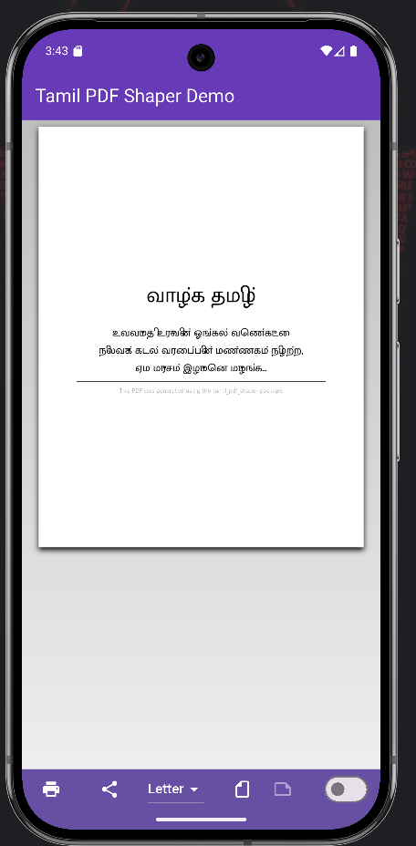
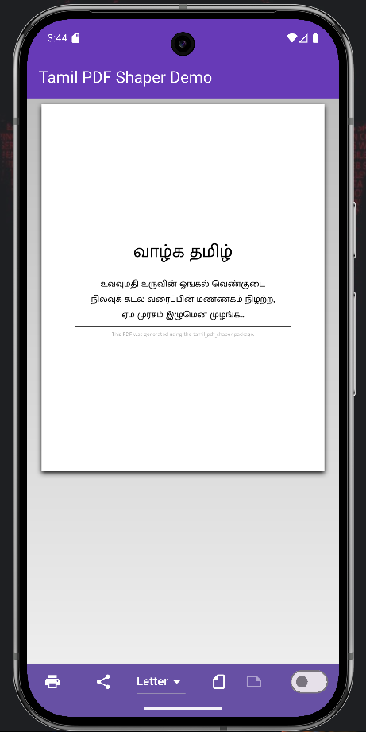
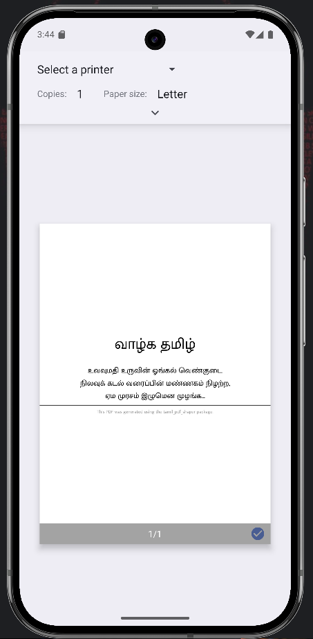

# Tamil PDF Shaper

A production-grade Flutter engine for rendering Tamil Unicode text correctly in PDF documents.

---

## வணக்கம் (Hello)

Rendering Indic languages like Tamil in standard PDF generators (like `package:pdf`) is historically difficult. Standard Unicode strings often break because PDF renderers lack complex text shaping engines (HarfBuzz, etc.) required to handle Tamil character composition and reordering.

**Tamil PDF Shaper** solves this by:

* Bundling a compatible Tamil font (Anand MuktaMalar)
* Providing a shaping engine that converts Unicode Tamil text into correct glyph sequences for PDF rendering

Built for Tamil developers and global Flutter users.

---

## 🚀 Features

* 🔡 **Zero Configuration** – Font included and auto-loaded
* ⚡ **High Performance** – Optimized StringBuffer-based conversion
* 🛡️ **Safe Rendering** – Handles mixed English + Tamil text gracefully
* 💙 **Flutter Native** – Designed specifically for Flutter PDF workflows
* 🌍 **Unicode Aware** – Supports proper Tamil glyph shaping

---

## 📦 Installation

Add to your `pubspec.yaml`:

```yaml
dependencies:
  tamil_pdf_shaper: ^1.0.0
```

Then run:

```bash
flutter pub get
```

---

## 🧠 Usage

### 1. Load the Font

Load the Tamil font once inside your PDF generation logic.

```dart
import 'package:tamil_pdf_shaper/tamil_pdf_shaper.dart';

final tamilFont = await TamilPdfFont.load();
```

---

### 2. Apply Tamil Shaping

Use the `.toTamilPdf` extension on any string:

```dart
pw.Text(
  "தமிழ் வாழ்க".toTamilPdf,
  style: pw.TextStyle(font: tamilFont, fontSize: 20),
);
```

---

## 🧾 Full Example

```dart
Future<Uint8List> generateInvoice(PdfPageFormat format) async {
  final pdf = pw.Document();
  final font = await TamilPdfFont.load();

  pdf.addPage(pw.Page(
    theme: pw.ThemeData.withFont(base: font),
    build: (ctx) => pw.Column(
      children: [
        pw.Text("பெயர்: ஆனந்த்".toTamilPdf),
        pw.Text("தேதி: 01/01/2024".toTamilPdf),
      ],
    ),
  ));

  return pdf.save();
}
```

---

## 🛠️ How It Works

Tamil PDF Shaper translates Unicode Tamil grapheme clusters into legacy-style glyph sequences required by the embedded font.

Example:

**கொ → ெ + க + ா**

Without shaping, PDF engines render incorrect character order.
This package ensures visually correct Tamil output inside PDFs.

---

## 📸 Visual Demo

<p align="center">
  <br>
  <em>Before shaping – incorrect Tamil rendering</em>
</p>

<p align="center">
  <br>
  <em>After shaping – correct Tamil glyph rendering</em>
</p>

<p align="center">
  <br>
  <em>Final rendered output inside PDF</em>
</p>

---

## 📣 Credits

* **Font:** Anand MuktaMalar (Open Source)
* **Project:** Tamil PDF Shaper
* **Repository:** [https://github.com/tharanitharan305/tamil_pdf_shaper](https://github.com/tharanitharan305/tamil_pdf_shaper)

Developed for the global Tamil developer community.

---

## 🤝 Open Source Contributions

Tamil PDF Shaper is open source and welcomes contributions from developers worldwide.

### How to Contribute

1. ⭐ Star the repository
2. Fork the project
3. Create a feature branch:

```bash
git checkout -b feature/your-feature-name
```

4. Commit your changes
5. Push to your fork
6. Open a Pull Request

---

### Ways to Help

* 🐛 Fix bugs
* ✨ Add new features
* 📖 Improve documentation
* 🧪 Add tests
* 💡 Suggest ideas

Every contribution helps grow the Tamil developer ecosystem 💙

---

## ☕ Support the Project

If this package helps you, consider supporting development:

<p>
  <a href="https://github.com/tharanitharan305/tamil_pdf_shaper">
    
  </a>
  &nbsp;&nbsp;
  <a href="https://pub.dev/packages/tamil_pdf_shaper">
    
  </a>
  &nbsp;&nbsp;
  <a href="https://buymeacoffee.com/tharanitharan">
    
  </a>
</p>

Your support helps maintain and improve the project ❤️

---

## 📜 License

This project is released under the MIT License.

---

**Made with ❤️ for Tamil**
